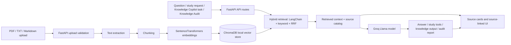

<div align="center">


### Document intelligence for study, research, and knowledge work.

Kroma turns your own PDF, TXT, and Markdown documents into answers, summaries, flashcards, quizzes, and workflow-ready outputs with visible source context. It is built for students, researchers, builders, and small teams who need useful AI responses without losing track of the evidence behind them.


**Live demo:** coming soon  
**Built by:** [Claire Ahito](https://github.com/berna-ahito) · CIT-U Cebu · 2026

[Live Demo](#live-demo) · [Features](#features) · [Architecture](#architecture) · [Run Locally](#run-locally)

</div>

---

## Live demo

Coming soon.

## Overview

Kroma is a local-document RAG app that lets users upload files, ask questions, inspect retrieved source chunks, and generate study or knowledge-work outputs from the same source-grounded index. Retrieval combines semantic vector search with keyword matching through reciprocal rank fusion (RRF).

It is designed for AI workflows where answers need to be useful, but also traceable back to the documents they came from. Request-scoped retrieval traces support internal observability and debugging without turning trace data into a public-facing feature.

Supported uploads: **PDF, TXT, Markdown (`.md`, `.markdown`)**. Text and Markdown files must be UTF-8 or UTF-8-SIG encoded.

## Preview

| Chat with sources |
|---|
|  |

Knowledge Copilot and Knowledge Audit screenshots can be added when available.

## Features

| Area | What users can do |
|---|---|
| Document chat | Ask questions across all documents or selected files, with hybrid semantic + keyword retrieval, source cards, locations, previews, and relevance scores. |
| Study tools | Generate flashcards, quizzes, summaries, suggestions, and browser PDF exports from uploaded sources. |
| Knowledge Copilot | Answer from sources, draft replies, summarize for a team, extract action items, or run risk checks. |
| Knowledge Audit | Review coverage, missing knowledge, risk areas, next documents, automation readiness, and AI-readiness scoring. |
| Trust controls | Return no-context refusals, sanitize model-provided source IDs, flag sensitive/external outputs for human review, and run deterministic evals. |
| Demo protection | Gate custom uploads and LLM-backed actions with `KROMA_DEMO_KEY`, while keeping a public sample mode available. |

## Architecture



## Tech stack

| Layer | Technology |
|---|---|
| Backend | Python · FastAPI |
| AI / LLM | Groq currently; adaptable to other LangChain-compatible chat model providers |
| RAG pipeline | LangChain · ChromaDB · hybrid retrieval/RRF |
| Embeddings | BAAI/bge-small-en-v1.5 · SentenceTransformers |
| Document processing | PyPDF · UTF-8 text/Markdown |
| Frontend | React 18 · Vite |
| Evals | Deterministic Python smoke evals |

## Routes

`/` serves the landing page, `/dashboard` serves the React app, `/app` and `/next` redirect to `/dashboard`, `/api/*` serves backend endpoints, and `/assets/*` serves built Vite assets.

## Run locally

Prerequisites: Python 3.10+, Node.js, and a Groq API key.

```powershell
git clone https://github.com/berna-ahito/kroma.git
cd kroma

py -m venv venv
.\venv\Scripts\Activate.ps1
.\venv\Scripts\python.exe -m pip install -r requirements.txt

Copy-Item .env.example .env
notepad .env
```

Set `GROQ_API_KEY` in `.env`, then run the backend:

```powershell
.\venv\Scripts\python.exe -m uvicorn backend.api:app --reload --port 8000
```

For frontend development:

```powershell
cd frontend
npm install
npm run dev
```

For production-like local routing through FastAPI:

```powershell
cd frontend
npm run build
cd ..
.\venv\Scripts\python.exe -m uvicorn backend.api:app --reload --port 8000
```

Visit `http://localhost:8000` for the landing page and `http://localhost:8000/dashboard` for the app.

## Running evals

Run `.\venv\Scripts\python.exe evals\trust_behavior.py` to check source display behavior, upload/delete validation, source ID sanitization, no-context responses, Knowledge Copilot safeguards, and Knowledge Audit readiness behavior.

## Project structure

```text
kroma/
├── backend/
│   ├── __init__.py
│   ├── api.py          # FastAPI routes, upload handling, chat, study, Copilot, and Audit APIs
│   ├── rag.py          # Retrieval, source handling, Groq generation
│   └── ingest.py       # Document loading, chunking, embeddings, ChromaDB writes
├── frontend/
│   ├── src/            # React dashboard source
│   └── dist/           # Generated by build; ignored by git
├── static/
│   └── landing.html    # Landing page served at /
├── assets/             # Logo and screenshots
├── evals/
│   └── trust_behavior.py
├── Dockerfile
├── render.yaml
├── requirements.txt
└── README.md
```

## Deployment notes

Kroma can deploy to Render as a Docker Web Service. The Docker image builds `frontend/dist` in a Node stage, copies the assets into the Python runtime image, and runs `uvicorn backend.api:app --host 0.0.0.0 --port ${PORT:-8000}` without `--reload`.

The current deployment uses `GROQ_API_KEY`. To use another LLM provider, update the backend generation adapter and corresponding environment variables.

| Variable | Purpose |
|---|---|
| `GROQ_API_KEY` | Required for LLM-backed chat, study tools, Knowledge Copilot, and Knowledge Audit. |
| `KROMA_DEMO_KEY` | Optional key for protected custom-document demo actions. |
| `APP_ENV` | Set to `production` to disable `/docs`, `/redoc`, and `/openapi.json`; `render.yaml` sets this for Render. |
| `KROMA_RATE_LIMIT_REQUESTS` | Optional Groq-backed endpoint request limit. |
| `KROMA_RATE_LIMIT_WINDOW_SECONDS` | Optional Groq-backed endpoint rate-limit window. |

Render Free caveats:

- Uploaded files, Chroma indexes, index metadata, and embedding model cache are ephemeral. For real use, persist `docs/`, `chroma_db/`, `chroma_db_next/`, and `index_stats.json` on a disk or external service.
- Cold starts can delay the first request after inactivity.
- The embedding model (`BAAI/bge-small-en-v1.5`) may download on the first `/api/process` call.
- `GET /health` is public and returns `{"status": "ok"}` for Render health checks.

Demo behavior: when `KROMA_DEMO_KEY` is set, uploads, processing, deletion, library clearing, unrestricted chat, study generation, Knowledge Copilot, and Knowledge Audit require the `X-Kroma-Demo-Key` header. The landing page, dashboard, redirects, health check, and bundled public sample remain available; unkeyed visitors can use suggested sample questions without consuming Groq tokens.

## Product direction

AI-generated answers are often hard to verify. Kroma focuses on making document-based AI responses easier to inspect by pairing chat, study tools, Knowledge Copilot, and Knowledge Audit with visible source context.

The current version is an active build for source-grounded document chat and knowledge workflows. Future direction may include persistent storage, team-ready document libraries, richer audit reports, and integrations for business knowledge bases.

## Contact

**GitHub:** [berna-ahito](https://github.com/berna-ahito)  
**LinkedIn:** [bernadeth-ahito](https://www.linkedin.com/in/bernadeth-ahito/)  
**Location:** Cebu, Philippines
