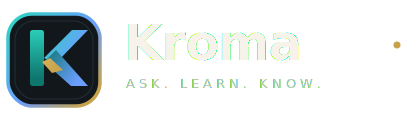
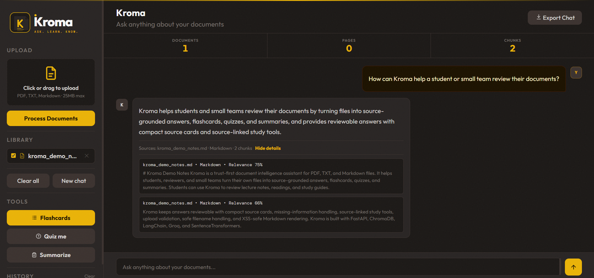
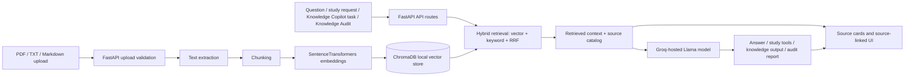

<div align="center">



### Document intelligence for study, research, and knowledge work.

Kroma turns your PDF, TXT, and Markdown files into answers, summaries, flashcards, quizzes, and audit reports — with visible source context so you can check where each answer came from.


**Built by:** [Claire Ahito](https://github.com/berna-ahito) · CIT-U Cebu · 2026

[Live Demo](https://kroma-knyd.onrender.com) · [Features](#features) · [Architecture](#architecture) · [Run Locally](#run-locally)

</div>

---

## Live demo

**[https://kroma-knyd.onrender.com](https://kroma-knyd.onrender.com)**

The public demo includes a bundled sample document you can query immediately. Custom uploads and LLM-backed document actions require a demo key.

> **Note:** Hosted on Render Free. First request after inactivity may take a few seconds due to a cold start. Uploaded files and indexes are ephemeral — not persisted between restarts.

## Overview

Many AI tools answer your questions but give you no way to check their work. Kroma pairs every answer with the source passages it came from, so you can read the evidence, judge the relevance, and decide how much to trust it.

Upload your own notes, research briefs, PDFs, or Markdown files. Then ask questions, run Knowledge Copilot tasks, generate study materials, or audit what your document library does and does not cover.

Under the hood, retrieval combines semantic vector search with keyword matching via reciprocal rank fusion (RRF). Request-scoped traces provide internal observability without exposing raw retrieval data to the UI.

Supported uploads: **PDF, TXT, Markdown (`.md`, `.markdown`)** — UTF-8 or UTF-8-SIG encoded.

## Preview

| Chat with sources |
|---|
|  |

## Features

| Area | What it does |
|---|---|
| Document chat | Ask questions across your uploaded files. Answers include source cards with document location, a passage preview, and a relevance score. |
| Study tools | Generate flashcards, quizzes, summaries, and suggestions from your sources. Export to PDF from the browser. |
| Knowledge Copilot | Draft replies, summarize for a team, extract action items, or run a risk check — all grounded in your uploaded documents. |
| Knowledge Audit | Review coverage gaps, missing knowledge areas, risk zones, next document suggestions, and AI-readiness scoring for your library. |
| Trust controls | No-context refusals when evidence is absent, sanitized source IDs, flagging of sensitive or external outputs, and deterministic behavioral evals. |
| Demo protection | Custom uploads and LLM-backed actions are gated by `KROMA_DEMO_KEY`. The bundled sample document and suggested questions remain public. |

## Architecture



## Tech stack

| Layer | Technology |
|---|---|
| Backend | Python · FastAPI |
| AI / LLM | Groq (current); adaptable to other LangChain-compatible chat model providers |
| RAG pipeline | LangChain · ChromaDB · hybrid semantic + keyword retrieval with RRF |
| Embeddings | BAAI/bge-small-en-v1.5 · SentenceTransformers |
| Document processing | PyPDF · UTF-8 text/Markdown |
| Frontend | React 18 · Vite |
| Evals | Deterministic Python smoke evals |

## Routes

| Route | Behavior |
|---|---|
| `/` | Landing page |
| `/dashboard` | React app |
| `/app`, `/next` | Redirect to `/dashboard` |
| `/api/*` | Backend endpoints |
| `/assets/*` | Built Vite assets |
| `/docs`, `/redoc`, `/openapi.json` | Disabled in production (`APP_ENV=production`) |

## Run locally

Prerequisites: Python 3.10+, Node.js, and a Groq API key.

```powershell
git clone https://github.com/berna-ahito/kroma.git
cd kroma

py -m venv venv
.\venv\Scripts\Activate.ps1
.\venv\Scripts\python.exe -m pip install -r requirements.txt

Copy-Item .env.example .env
notepad .env
```

Set `GROQ_API_KEY` in `.env`, then start the backend:

```powershell
.\venv\Scripts\python.exe -m uvicorn backend.api:app --reload --port 8000
```

For frontend development (Vite dev server):

```powershell
cd frontend
npm install
npm run dev
```

For production-like local routing through FastAPI:

```powershell
cd frontend
npm run build
cd ..
.\venv\Scripts\python.exe -m uvicorn backend.api:app --reload --port 8000
```

Visit `http://localhost:8000` for the landing page and `http://localhost:8000/dashboard` for the app.

## Running evals

```powershell
.\venv\Scripts\python.exe evals\trust_behavior.py
```

Checks source display behavior, upload/delete validation, source ID sanitization, no-context responses, Knowledge Copilot safeguards, and Knowledge Audit readiness scoring.

## Project structure

```text
kroma/
├── backend/
│   ├── __init__.py
│   ├── api.py          # FastAPI routes, upload handling, chat, study, Copilot, and Audit APIs
│   ├── rag.py          # Retrieval, source handling, Groq generation
│   └── ingest.py       # Document loading, chunking, embeddings, ChromaDB writes
├── frontend/
│   ├── src/            # React dashboard source
│   └── dist/           # Generated by build; ignored by git
├── static/
│   └── landing.html    # Landing page served at /
├── assets/             # Logo and screenshots
├── evals/
│   └── trust_behavior.py
├── Dockerfile
├── render.yaml
├── requirements.txt
└── README.md
```

## Deployment notes

Kroma deploys to Render as a Docker Web Service. The Docker image builds `frontend/dist` in a Node stage, copies assets into the Python runtime image, and runs:

```
uvicorn backend.api:app --host 0.0.0.0 --port ${PORT:-8000}
```

No `--reload` in production.

### Environment variables

| Variable | Purpose |
|---|---|
| `GROQ_API_KEY` | Required for LLM-backed chat, study tools, Knowledge Copilot, and Knowledge Audit. |
| `KROMA_DEMO_KEY` | Optional key for protected custom-document demo actions. |
| `APP_ENV` | Set to `production` to disable `/docs`, `/redoc`, and `/openapi.json`. `render.yaml` sets this automatically. |
| `KROMA_RATE_LIMIT_REQUESTS` | Optional request cap for Groq-backed endpoints. |
| `KROMA_RATE_LIMIT_WINDOW_SECONDS` | Optional rate-limit window (seconds). |

### Render Free caveats

- Uploaded files, Chroma indexes, index metadata, and embedding model cache are ephemeral. For persistent use, mount `docs/`, `chroma_db/`, `chroma_db_next/`, and `index_stats.json` on a disk or external service.
- Cold starts can delay the first request after inactivity.
- The embedding model (`BAAI/bge-small-en-v1.5`) may download on the first `/api/process` call.
- `GET /health` returns `{"status": "ok"}` and is always public.

### Demo key behavior

When `KROMA_DEMO_KEY` is set, uploads, processing, deletion, library clearing, unrestricted chat, study generation, Knowledge Copilot, and Knowledge Audit all require the `X-Kroma-Demo-Key` header. The landing page, dashboard, health check, and bundled sample document remain publicly accessible.

## Product direction

Kroma is a document-intelligence app built around a simple idea: AI responses from your own documents should be easy to inspect, not just fast to generate.

The current version handles document chat, study tools, knowledge workflows, and coverage audits — with retrieval traces and behavioral evals built in from the start. The roadmap focuses on what makes this genuinely useful for real teams: persistent document libraries, richer audit reports, shareable knowledge bases, and integrations with tools that organizations already use.

## Contact

**GitHub:** [berna-ahito](https://github.com/berna-ahito)  
**LinkedIn:** [bernadeth-ahito](https://www.linkedin.com/in/bernadeth-ahito/)  
**Location:** Cebu, Philippines
