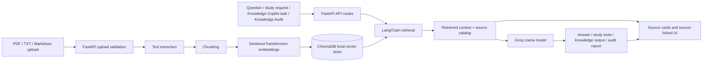

<div align="center">


### Source-grounded document intelligence for study, research, and knowledge work.

Kroma helps people turn their own PDF, TXT, and Markdown documents into answers, summaries, flashcards, quizzes, and workflow-ready knowledge outputs they can trace back to sources. It is built for students, researchers, builders, and small teams who need AI help without losing sight of the evidence behind each response.


**Live demo:** coming soon  
**Built by:** [Claire Ahito](https://github.com/berna-ahito) · CIT-U Cebu · 2026

[Live Demo](#live-demo) · [Features](#features) · [Architecture](#architecture) · [Run Locally](#run-locally)

</div>

---

## Live demo

Coming soon.

## Overview

Kroma is a local-document RAG app built around trust: upload your files, ask a question, and review the retrieved chunks that shaped the answer.

The app keeps source previews, locations, and relevance signals close to the answer, so visitors can see how retrieval, generation, and verification fit together in a practical AI product.

It currently supports **PDF, TXT, and Markdown** uploads. Text and Markdown files must be UTF-8 or UTF-8-SIG encoded.

## What this proves

- End-to-end RAG product design: upload validation, indexing, retrieval, generation, source display, and export.
- Trust-first AI behavior: no-context refusals, source ID sanitization, human-review flags, and deterministic evals.
- Portfolio-ready deployment thinking: React dashboard, FastAPI backend, Docker build, Render notes, and demo-key hardening.

## Preview

| Chat with sources |
|---|
|  |

Knowledge Copilot and Knowledge Audit screenshots can be added when available.

## Features

| Feature | Description |
|---|---|
| Document chat | Ask questions and get answers grounded in retrieved chunks from uploaded files |
| Source cards | See retrieved chunks, document names, page/location labels, previews, and relevance scores |
| Source filtering | Query all documents or limit retrieval to selected files |
| Flashcards | Generate Q&A cards with source links when the source is available |
| Quiz mode | Generate multiple-choice questions by difficulty, with source-linked explanations |
| Smart summary | Create structured summaries with linked supporting chunks |
| PDF export | Save a chat session as a clean PDF from the browser |
| Knowledge Copilot | Run structured knowledge tasks against your documents: answer from sources, draft a reply, summarize for a team, extract action items, or run a risk check |
| Knowledge Audit | Assess whether selected documents are ready for source-grounded AI workflows by reviewing coverage, missing knowledge, risk areas, next documents, and automation readiness |
| Readiness verdict | Produces a Low / Medium / High readiness verdict based on document coverage, missing knowledge, and risk areas |
| Verified facts / missing information | Structured workflows separate source-backed facts, missing information, and unsupported areas instead of blending them into one answer. |
| Human review flags | Outputs targeting external audiences or containing sensitive content are flagged for human review before use |

## Why Kroma is different

- **Sources are part of the product.** Answers, flashcards, quizzes, summaries, Knowledge Copilot, and Knowledge Audit outputs can expose the chunks used to support them.
- **Source-grounded structured outputs.** Knowledge Copilot and Knowledge Audit return verified facts, suggested outputs, missing information, and sources used — all grounded in retrieved document chunks.
- **No-context LLM guard.** If retrieval finds no usable context, document chat, Knowledge Copilot, and Knowledge Audit return a deterministic "not found in uploaded documents" response without calling Groq.
- **Human review / risk framing.** Outputs targeting external audiences are flagged for human review before use, and Knowledge Audit flags risk areas.
- **Knowledge readiness layer.** Knowledge Audit checks whether selected documents have enough coverage for AI workflows and flags gaps, risks, and next documents to upload.
- **Source ID sanitization.** Study tools, Knowledge Copilot, and Knowledge Audit outputs use internal source IDs; invalid or model-invented IDs are stripped before rendering.
- **Optional demo gate.** Public demos can set `KROMA_DEMO_KEY` to require a simple header key on upload, indexing, delete, unrestricted document chat, study-generation, Knowledge Copilot, and Knowledge Audit endpoints.
- **Public sample mode.** When the demo gate is active, visitors without the key can still try a bundled sample document with suggested questions and source cards.
- **Upload hardening.** Filenames are sanitized, path traversal is rejected, uploads are capped at 25 MB, and file content is checked against supported types.
- **XSS-safe rendering.** AI Markdown output is sanitized before display, and most dynamic UI text is rendered through text nodes.
- **Trust behavior evals.** Deterministic smoke evals cover source display rules, source ID sanitization, upload/delete validation, no-context behavior, Knowledge Copilot human-review and malformed-output cases, and Knowledge Audit readiness-verdict cases.

## Architecture



## Tech stack

| Layer | Technology |
|---|---|
| Backend | Python · FastAPI |
| AI / LLM | Groq API · Llama 4 Scout |
| RAG pipeline | LangChain · ChromaDB |
| Embeddings | BAAI/bge-small-en-v1.5 · SentenceTransformers |
| Document processing | PyPDF · UTF-8 text/Markdown |
| Frontend | React 18 · Vite |
| Evals | Deterministic Python smoke evals |

## Routes

| Route | Purpose |
|---|---|
| `/` | Landing page |
| `/dashboard` | React dashboard app served from `frontend/dist` |
| `/app` | Redirects to `/dashboard` for backward compatibility |
| `/next` | Redirects to `/dashboard` for migration compatibility |
| `/api/*` | FastAPI backend endpoints |
| `/assets/*` | Built React assets generated by Vite |

`static/landing.html` is the public landing page served at `/`.

## Run locally

**Prerequisites:** Python 3.10+ and a Groq API key.

```powershell
git clone https://github.com/berna-ahito/kroma.git
cd kroma

py -m venv venv
.\venv\Scripts\Activate.ps1

.\venv\Scripts\python.exe -m pip install -r requirements.txt

Copy-Item .env.example .env
notepad .env

.\venv\Scripts\python.exe -m uvicorn backend.api:app --reload --port 8000
```

For frontend development, run Vite in a second terminal:

```powershell
cd frontend
npm install
npm run dev
```

For production-like local routing through FastAPI, build the React assets first, then run the backend:

```powershell
cd frontend
npm run build
cd ..
.\venv\Scripts\python.exe -m uvicorn backend.api:app --reload --port 8000
```

Visit:

- Landing page: `http://localhost:8000`
- React dashboard: `http://localhost:8000/dashboard`
- Backward-compatible redirects: `http://localhost:8000/app` and `http://localhost:8000/next`

Hosted demos on free tiers may take a short cold start after inactivity.

## Running evals

```powershell
.\venv\Scripts\python.exe evals\trust_behavior.py
```

The evals cover: source display behavior, upload and delete validation, source ID sanitization, no-context behavior, Knowledge Copilot human-review and malformed-output cases, and Knowledge Audit no-context, source sanitization, and readiness-verdict cases.

## Project structure

```text
kroma/
├── backend/
│   ├── __init__.py
│   ├── api.py          # FastAPI routes, upload handling, chat, study, Knowledge Copilot, and Knowledge Audit APIs
│   ├── rag.py          # Retrieval, source handling, Groq generation
│   └── ingest.py       # Document loading, chunking, embeddings, ChromaDB writes
├── frontend/           # React dashboard source and Vite config
│   ├── src/            # Active app source
│   └── dist/           # Generated by build; ignored by git
├── static/
│   └── landing.html    # Public landing page served at /
├── assets/             # Screenshots and static assets
├── evals/
│   └── trust_behavior.py
├── Dockerfile
├── render.yaml
├── requirements.txt
└── README.md
```

## Deployment notes

### Render Free (Docker)

Kroma can be deployed to Render as a Docker Web Service.

**Before deploying:**

1. Fork or push this repo to GitHub.
2. In the Render Dashboard, create a **New Web Service** → **Connect a repository** → select your fork.
3. Render auto-detects the `Dockerfile`. No build command is needed.
   The Docker image builds `frontend/dist` automatically in a Node builder stage, then copies the generated assets into the Python runtime image. `frontend/dist` remains ignored by git.
4. Set the following **Environment Variable** (never in code):

   | Variable | Value |
   |---|---|
   | `GROQ_API_KEY` | Required for LLM-backed chat, study tools, Knowledge Copilot, and Knowledge Audit |
   | `KROMA_DEMO_KEY` | Optional demo access key for protected demo/custom document actions |
   | `APP_ENV` | Set to `production` to disable `/docs`, `/redoc`, and `/openapi.json`; Render sets this in `render.yaml` |
   | `KROMA_RATE_LIMIT_REQUESTS` | Optional Groq-backed endpoint request limit override |
   | `KROMA_RATE_LIMIT_WINDOW_SECONDS` | Optional Groq-backed endpoint rate-limit window override |

5. Leave `PORT` unset — Render injects it automatically. The Dockerfile reads `${PORT:-8000}`.
   The production command is `uvicorn backend.api:app --host 0.0.0.0 --port ${PORT:-8000}` and does not use `--reload`.

**Render Free limitations (portfolio demo):**

- **Ephemeral filesystem.** Uploaded documents, Chroma indexes, index metadata, and embedding model cache are lost on restart or redeploy. For real use, persist `docs/`, `chroma_db/`, `chroma_db_next/`, and `index_stats.json` on a disk or volume.
- **Cold starts.** The free tier spins down after inactivity. Expect 30–60 s delay on the first request.
- **SentenceTransformer model download.** The embedding model (`BAAI/bge-small-en-v1.5`) downloads on first `/api/process` call, adding startup latency. The Docker image keeps Hugging Face/Transformers online and installs CPU-only PyTorch, so no CUDA/GPU packages are required.
- **Demo protection.** If `KROMA_DEMO_KEY` is set, the app requires the `X-Kroma-Demo-Key` header for upload, processing, deletion, clear-library, unrestricted document chat, flashcards, quiz, summary, suggestions, the Knowledge Copilot (`/api/business-copilot`), and Knowledge Audit (`/api/knowledge-audit`) endpoints. `/health`, `/`, `/dashboard`, `/app`, `/next`, and the bundled public sample demo stay public. `/api/status` hides protected metadata unless the correct demo key is supplied. The frontend stores the entered demo key in browser `sessionStorage` only.
- **Production docs lock-down.** With `APP_ENV=production`, FastAPI disables `/docs`, `/redoc`, and `/openapi.json`.
- **Public sample demo.** Visitors without the key see: "Public demo uses a sample document. Enter demo key to test your own files." They can ask only the suggested sample questions; custom files and library actions remain blocked. The public sample uses deterministic bundled answers, so unkeyed visitors do not consume Groq tokens.
- **Not production-ready.** For persistent storage, add a Render Disk, object storage, or a managed vector DB (e.g., Chroma Cloud, Pinecone, Supabase pgvector) and mount persistent volumes.

**Health check.** Render pings `GET /health` (returns `{"status": "ok"}`). This endpoint requires no API key, no document load, and no Chroma connection.

## Portfolio context

Kroma is Build 1 of my AI engineering portfolio. It demonstrates a full RAG loop: hardened uploads, local indexing, vector retrieval, LLM-backed answers, source-aware UI, and deterministic trust behavior checks.

The Knowledge Copilot layer extends Kroma beyond study and chat into a real-world workflow tool: given your uploaded documents, it can produce source-grounded answers, draft replies, team summaries, extracted action items, and risk checks — with missing-information refusal when context is absent and human review flags when outputs are destined for external audiences.

The Knowledge Audit layer adds a readiness check for real-world AI workflows: it reviews document coverage, missing knowledge, risk areas, suggested next documents, automation readiness, and a deterministic Low / Medium / High verdict.

**Next builds:** Lead Qualification Agent · Content Repurposing Pipeline · Voice AI Agent · Multi-Agent Research Writer

## Contact

**GitHub:** [berna-ahito](https://github.com/berna-ahito)  
**LinkedIn:** [bernadeth-ahito](https://www.linkedin.com/in/bernadeth-ahito/)  
**Location:** Cebu, Philippines
