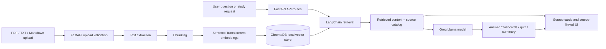

<div align="center">

# Kroma

### Trust-first document intelligence for your own notes, papers, and files.

Ask questions, generate study tools, and inspect the sources behind each answer across PDF, TXT, and Markdown documents.


**Live demo:** coming soon  
**Built by:** [Claire Ahito](https://github.com/berna-ahito) · CIT-U Cebu · 2026

</div>

---

## Overview

Kroma is a local-document RAG app built around trust: upload your files, ask a question, and review the retrieved source chunks that shaped the answer. It is designed for students, researchers, and builders who need document answers they can trace back to their own material.

It currently supports **PDF, TXT, and Markdown** uploads. Text and Markdown files must be UTF-8 or UTF-8-SIG encoded.

## Preview

Real screenshots should be added at these paths when available. No mock screenshots are included.

| Chat with sources |
|---|
|  |

## What it does

| Feature | Description |
|---|---|
| Document chat | Ask questions and get answers grounded in retrieved chunks from uploaded files |
| Source cards | See retrieved chunks, document names, page/location labels, previews, and relevance scores |
| Source filtering | Query all documents or limit retrieval to selected files |
| Flashcards | Generate Q&A cards with source links when the source is available |
| Quiz mode | Generate multiple-choice questions by difficulty, with source-linked explanations |
| Smart summary | Create structured summaries with linked supporting chunks |
| PDF export | Save a chat session as a clean PDF from the browser |

## Why Kroma is different

- **Sources are part of the product.** Answers, flashcards, quizzes, and summaries can expose the chunks used to support them.
- **Missing-info guard.** Source cards are hidden for greetings, unsupported answers, or cases without retrieved context.
- **No-context LLM guard.** If retrieval finds no usable context, Kroma returns a deterministic "not found in uploaded documents" response without calling Groq.
- **Optional demo gate.** Public demos can set `KROMA_DEMO_KEY` to require a simple header key on upload, indexing, delete, unrestricted document chat, and study-generation endpoints.
- **Public sample mode.** When the demo gate is active, visitors without the key can still try a bundled sample document with suggested questions and source cards.
- **Source-linked study tools.** Generated study content uses internal source IDs, then strips invalid or model-invented IDs before rendering.
- **Upload hardening.** Filenames are sanitized, path traversal is rejected, uploads are capped at 25 MB, and file content is checked against supported types.
- **XSS-safe rendering.** AI Markdown output is sanitized before display, and most dynamic UI text is rendered through text nodes.
- **Trust behavior evals.** Deterministic smoke evals cover source display rules, source ID sanitization, supported upload validation, and delete-path validation.

## Architecture



## Tech stack

| Layer | Technology |
|---|---|
| Backend | Python · FastAPI |
| AI / LLM | Groq API · Llama 4 Scout |
| RAG pipeline | LangChain · ChromaDB |
| Embeddings | BAAI/bge-small-en-v1.5 · SentenceTransformers |
| Document processing | PyPDF · UTF-8 text/Markdown |
| Frontend | Vanilla HTML · CSS · JavaScript |
| Evals | Deterministic Python smoke evals |

## Running locally

**Prerequisites:** Python 3.10+ and a Groq API key.

```powershell
git clone https://github.com/berna-ahito/kroma.git
cd kroma

py -m venv venv
.\venv\Scripts\Activate.ps1

.\venv\Scripts\python.exe -m pip install -r requirements.txt

Copy-Item .env.example .env
notepad .env

.\venv\Scripts\python.exe -m uvicorn api:app --reload --port 8000
```

Visit:

- Landing page: `http://localhost:8000`
- App: `http://localhost:8000/app`

Hosted demos on free tiers may take a short cold start after inactivity.

## Running evals

```powershell
.\venv\Scripts\python.exe evals\trust_behavior.py
```

## Project structure

```text
kroma/
├── api.py              # FastAPI routes, upload handling, chat and study APIs
├── rag.py              # Retrieval, source handling, Groq generation
├── ingest.py           # Document loading, chunking, embeddings, ChromaDB writes
├── static/
│   ├── landing.html    # Landing page
│   └── index.html      # Main app UI
├── evals/
│   └── trust_behavior.py
├── requirements.txt
└── README.md
```

## Deployment notes

### Render Free (Docker)

Kroma can be deployed to Render as a Docker Web Service.

**Before deploying:**

1. Fork or push this repo to GitHub.
2. In the Render Dashboard, create a **New Web Service** → **Connect a repository** → select your fork.
3. Render auto-detects the `Dockerfile`. No build command is needed.
4. Set the following **Environment Variable** (never in code):

   | Variable | Value |
   |---|---|
   | `GROQ_API_KEY` | Your Groq API key |
   | `KROMA_DEMO_KEY` | Optional demo access key for public portfolio deployments |

5. Leave `PORT` unset — Render injects it automatically. The Dockerfile reads `${PORT:-8000}`.

**Render Free limitations (portfolio demo):**

- **Ephemeral filesystem.** Uploaded documents, Chroma index, and embedding model cache are lost on restart or redeploy. Uploads + re-indexing are needed after each restart.
- **Cold starts.** The free tier spins down after inactivity. Expect 30–60 s delay on the first request.
- **SentenceTransformer model download.** The embedding model (`BAAI/bge-small-en-v1.5`) downloads on first `/api/process` call, adding startup latency. The Docker image keeps Hugging Face/Transformers online and installs CPU-only PyTorch, so no CUDA/GPU packages are required.
- **Demo protection.** If `KROMA_DEMO_KEY` is set, the app requires the `X-Kroma-Demo-Key` header for upload, processing, deletion, clear-library, unrestricted document chat, flashcards, quiz, summary, and suggestions. `/health`, `/`, `/app`, `/api/status`, and the bundled public sample demo stay public. The frontend stores the entered demo key in browser `sessionStorage` only.
- **Public sample demo.** Visitors without the key see: "Public demo uses a sample document. Enter demo key to test your own files." They can ask only the suggested sample questions; custom files and library actions remain blocked. The public sample uses deterministic bundled answers, so unkeyed visitors do not consume Groq tokens.
- **Not production-ready.** For persistent storage, add a Render Disk, object storage, or a managed vector DB (e.g., Chroma Cloud, Pinecone, Supabase pgvector) and mount persistent volumes.

**Health check.** Render pings `GET /health` (returns `{"status": "ok"}`). This endpoint requires no API key, no document load, and no Chroma connection.

## Portfolio context

Kroma is Build 1 of my AI engineering portfolio. It demonstrates a full RAG loop: hardened uploads, local indexing, vector retrieval, LLM-backed answers, source-aware UI, and deterministic trust behavior checks.

**Next builds:** Lead Qualification Agent · Content Repurposing Pipeline · Voice AI Agent · Multi-Agent Research Writer

## Contact

**GitHub:** [berna-ahito](https://github.com/berna-ahito)  
**LinkedIn:** [bernadeth-ahito](https://www.linkedin.com/in/bernadeth-ahito/)  
**Location:** Cebu, Philippines
